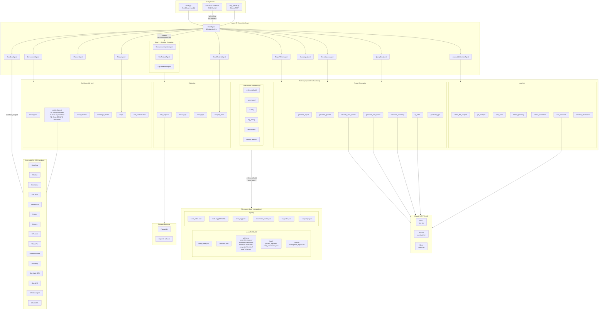
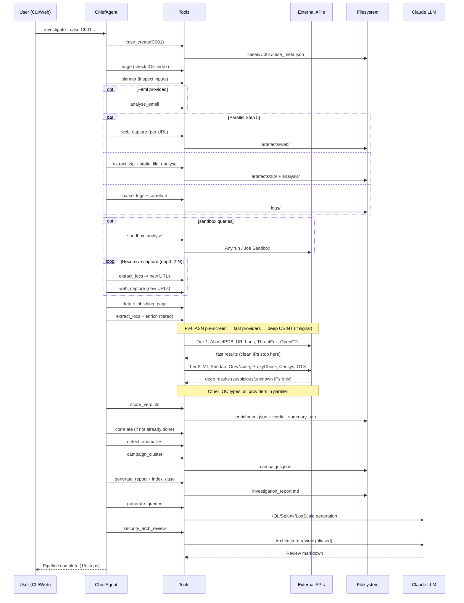
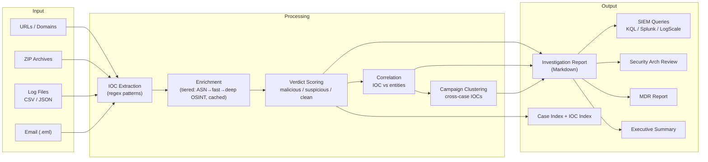
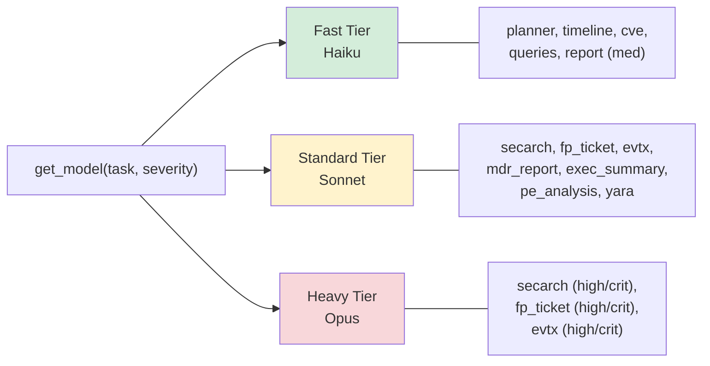

# SOC-AI Architecture Diagram

## High-Level System Architecture

```mermaid
graph TB
    subgraph Entry["Entry Points"]
        CLI["socai.py<br/>CLI (28 commands)"]
        WEB["FastAPI + case.html<br/>Web Chat UI"]
        MCP["mcp_server.py<br/>Claude MCP"]
    end

    subgraph Orchestration["Agent Orchestration Layer"]
        CHIEF["ChiefAgent<br/>15-step pipeline"]
        CHIEF --> TRIAGE["TriageAgent"]
        CHIEF --> PLANNER["PlannerAgent"]
        CHIEF --> EMAIL_A["EmailAnalystAgent"]
        CHIEF -->|"parallel<br/>ThreadPoolExecutor"| PAR
        subgraph PAR["Step 5 -- Parallel Execution"]
            DOMAIN["DomainInvestigatorAgent"]
            FILE_A["FileAnalystAgent"]
            LOG_A["LogCorrelatorAgent"]
        end
        CHIEF --> SANDBOX_A["SandboxAgent"]
        CHIEF --> ENRICH_A["EnrichmentAgent"]
        CHIEF --> ANOMALY["AnomalyDetectionAgent"]
        CHIEF --> CAMPAIGN_A["CampaignAgent"]
        CHIEF --> REPORT_A["ReportWriterAgent"]
        CHIEF --> QUERY_A["QueryGenAgent"]
        CHIEF --> SECARCH_A["SecurityArchAgent"]
    end

    CLI --> CHIEF
    WEB -->|"api/chat.py<br/>tool dispatch"| CHIEF
    MCP --> CHIEF

    subgraph Tools["Tool Layer (stateless functions)"]
        direction LR
        subgraph Collection["Collection"]
            WC["web_capture"]
            EZ["extract_zip"]
            PL["parse_logs"]
            AE["analyse_email"]
        end
        subgraph Analysis["Analysis"]
            SFA["static_file_analyse"]
            PE["pe_analysis"]
            YARA["yara_scan"]
            DP["detect_phishing"]
            DA["detect_anomalies"]
            EVTX["evtx_correlate"]
            TL["timeline_reconstruct"]
        end
        subgraph Intel["Enrichment & Intel"]
            EI["extract_iocs"]
            EN["enrich (tiered)<br/>T0: ASN pre-screen<br/>T1: Fast (4 providers)<br/>T2: Deep OSINT (6 providers)"]
            SV["score_verdicts"]
            CC["campaign_cluster"]
            TR["triage"]
            CVE["cve_contextualise"]
        end
        subgraph Output["Report Generation"]
            GR["generate_report"]
            GQ["generate_queries"]
            MDR["generate_mdr_report"]
            ES["executive_summary"]
            FP["fp_ticket"]
            SAR["security_arch_review"]
            PPTX["generate_pptx"]
        end
        subgraph Core["Core Utilities (common.py)"]
            WA["write_artefact()"]
            SJ["save_json()"]
            AU["audit()"]
            LE["log_error()"]
            GM["get_model()"]
            DF["defang_report()"]
        end
    end

    PAR --> Collection
    ENRICH_A --> Intel
    ANOMALY --> Analysis
    REPORT_A --> Output
    SECARCH_A --> Output
    QUERY_A --> Output
    SANDBOX_A -->|"sandbox_analyse"| ExtAPIs
    EMAIL_A --> AE
    TRIAGE --> TR

    subgraph ExtAPIs["External APIs (15 Providers)"]
        direction LR
        VT["VirusTotal"]
        SH["Shodan"]
        GN["GreyNoise"]
        US["URLScan"]
        AB["AbuseIPDB"]
        IZ["Intezer"]
        CS["Censys"]
        UH["URLhaus"]
        TF["ThreatFox"]
        MB["MalwareBazaar"]
        ER["EmailRep"]
        OTX["AlienVault OTX"]
        OCT["OpenCTI"]
        HA["Hybrid Analysis"]
        WX["WhoisXML"]
    end

    subgraph LLM["Claude LLM (Tiered)"]
        HAIKU["Haiku<br/>fast tier"]
        SONNET["Sonnet<br/>standard tier"]
        OPUS["Opus<br/>heavy tier"]
    end

    subgraph Browser["Browser Backend"]
        PW["Playwright"]
        RQ["requests fallback"]
    end

    EN --> ExtAPIs
    SAR --> LLM
    MDR --> LLM
    ES --> LLM
    FP --> LLM
    EVTX --> LLM
    WC --> Browser

    subgraph State["Filesystem State (no database)"]
        subgraph CaseDir["cases/CASE_ID/"]
            META["case_meta.json"]
            IOCS["iocs/iocs.json"]
            ART["artefacts/<br/>web/ zip/ analysis/<br/>enrichment/ phishing/<br/>sandbox/ anomalies/<br/>campaign/ timeline/<br/>yara/ evtx/ cve/"]
            LOGS["logs/<br/>parsed_logs.json<br/>entity_correlation.json"]
            RPT["reports/<br/>investigation_report.md"]
        end
        subgraph Registry["registry/"]
            CI["case_index.json"]
            ALOG["audit.log (SHA-256)"]
            ELOG["error_log.jsonl"]
            EC["enrichment_cache.json"]
            II["ioc_index.json"]
            CAMP["campaigns.json"]
        end
    end

    Tools -->|"write_artefact()<br/>save_json()"| State
```

## Pipeline Sequence

```mermaid
sequenceDiagram
    participant U as User (CLI/Web)
    participant C as ChiefAgent
    participant T as Tools
    participant E as External APIs
    participant F as Filesystem
    participant L as Claude LLM

    U->>C: investigate --case C001 ...
    C->>T: case_create(C001)
    T->>F: cases/C001/case_meta.json

    C->>T: triage (check IOC index)
    C->>T: planner (inspect inputs)

    opt --eml provided
        C->>T: analyse_email
    end

    par Parallel Step 5
        C->>T: web_capture (per URL)
        T->>F: artefacts/web/
    and
        C->>T: extract_zip + static_file_analyse
        T->>F: artefacts/zip/ + analysis/
    and
        C->>T: parse_logs + correlate
        T->>F: logs/
    end

    opt sandbox queries
        C->>T: sandbox_analyse
        T->>E: Any.run / Joe Sandbox
    end

    loop Recursive capture (depth 2-N)
        C->>T: extract_iocs -> new URLs
        C->>T: web_capture (new URLs)
    end

    C->>T: detect_phishing_page
    C->>T: extract_iocs + enrich (tiered)
    Note over T,E: IPv4: ASN pre-screen → fast providers → deep OSINT (if signal)
    T->>E: Tier 1: AbuseIPDB, URLhaus, ThreatFox, OpenCTI
    E-->>T: fast results (clean IPs stop here)
    T->>E: Tier 2: VT, Shodan, GreyNoise, ProxyCheck, Censys, OTX
    E-->>T: deep results (suspicious/unknown IPs only)
    Note over T,E: Other IOC types: all providers in parallel
    C->>T: score_verdicts
    T->>F: enrichment.json + verdict_summary.json

    C->>T: correlate (if not already done)
    C->>T: detect_anomalies
    C->>T: campaign_cluster
    T->>F: campaigns.json

    C->>T: generate_report + index_case
    T->>F: investigation_report.md

    C->>T: generate_queries
    T->>L: KQL/Splunk/LogScale generation

    C->>T: security_arch_review
    T->>L: Architecture review (aliased)
    L-->>T: Review markdown

    C-->>U: Pipeline complete (15 steps)
```

## Data Flow

```mermaid
flowchart LR
    subgraph Input
        URLs["URLs / Domains"]
        ZIP["ZIP Archives"]
        LOGS["Log Files<br/>CSV / JSON"]
        EML["Email (.eml)"]
    end

    subgraph Processing
        IOC["IOC Extraction<br/>(regex patterns)"]
        ENR["Enrichment<br/>(tiered: ASN→fast→deep OSINT, cached)"]
        SCORE["Verdict Scoring<br/>malicious / suspicious / clean"]
        CORR["Correlation<br/>IOC vs entities"]
        CAMP["Campaign Clustering<br/>cross-case IOCs"]
    end

    subgraph Output
        RPT["Investigation Report<br/>(Markdown)"]
        QRY["SIEM Queries<br/>KQL / Splunk / LogScale"]
        SAR["Security Arch Review"]
        MDR["MDR Report"]
        EXS["Executive Summary"]
        IDX["Case Index + IOC Index"]
    end

    URLs --> IOC
    ZIP --> IOC
    LOGS --> IOC
    EML --> IOC
    IOC --> ENR
    ENR --> SCORE
    SCORE --> CORR
    CORR --> CAMP
    SCORE --> RPT
    CORR --> RPT
    CAMP --> RPT
    RPT --> QRY
    RPT --> SAR
    RPT --> MDR
    RPT --> EXS
    SCORE --> IDX
```

## Model Tiering

```mermaid
graph LR
    GM["get_model(task, severity)"] --> FAST["Fast Tier<br/>Haiku"]
    GM --> STD["Standard Tier<br/>Sonnet"]
    GM --> HEAVY["Heavy Tier<br/>Opus"]

    FAST --- F_TASKS["planner, timeline, cve,<br/>queries, report (med)"]
    STD --- S_TASKS["secarch, fp_ticket, evtx,<br/>mdr_report, exec_summary,<br/>pe_analysis, yara"]
    HEAVY --- H_TASKS["secarch (high/crit),<br/>fp_ticket (high/crit),<br/>evtx (high/crit)"]

    style FAST fill:#d4edda
    style STD fill:#fff3cd
    style HEAVY fill:#f8d7da
```

## Enrichment Provider Matrix

```mermaid
graph TD
    subgraph IOC_Types["IOC Types"]
        IP["IPv4"]
        DOM["Domain"]
        URL["URL"]
        MD5["MD5"]
        SHA1["SHA1"]
        SHA256["SHA256"]
        EM["Email"]
        CVEID["CVE"]
    end

    subgraph Tier0["Tier 0 — ASN Pre-screen (IPv4 only)"]
        ASN["Team Cymru DNS<br/>(free, no key)"]
    end

    subgraph Tier1["Tier 1 — Fast/Free (IPv4)"]
        AIPDB["AbuseIPDB"]
        UH["URLhaus"]
        TF["ThreatFox"]
        OCTI["OpenCTI"]
    end

    subgraph Tier2["Tier 2 — Deep OSINT (IPv4, if signal)"]
        VT["VirusTotal"]
        SH["Shodan"]
        GN["GreyNoise"]
        PC["ProxyCheck"]
        CENS["Censys"]
        OTX["AlienVault OTX"]
    end

    subgraph Standard["Standard Providers"]
        USCAN["URLScan.io"]
        IZ["Intezer"]
        MB["MalwareBazaar"]
        EREP["EmailRep"]
        HYB["Hybrid Analysis"]
        WHOIS["WhoisXML"]
    end

    IP -->|"all IPs"| ASN
    ASN -->|"non-infra IPs"| AIPDB & UH & TF & OCTI
    AIPDB -->|"suspicious/unknown"| VT & SH & GN & PC & CENS & OTX

    DOM --> VT & USCAN & UH & TF & CENS & OTX & WHOIS & OCTI
    URL --> VT & USCAN & UH & TF & OTX & OCTI
    MD5 --> VT & IZ & MB & TF & OTX & OCTI
    SHA1 --> VT & IZ & OTX & OCTI
    SHA256 --> VT & IZ & MB & TF & HYB & OTX & OCTI
    EM --> EREP & OCTI
    CVEID --> OCTI

    style Tier0 fill:#0d2818,stroke:#238636
    style Tier1 fill:#1c1d00,stroke:#d29922
    style Tier2 fill:#2d1215,stroke:#f85149
```
