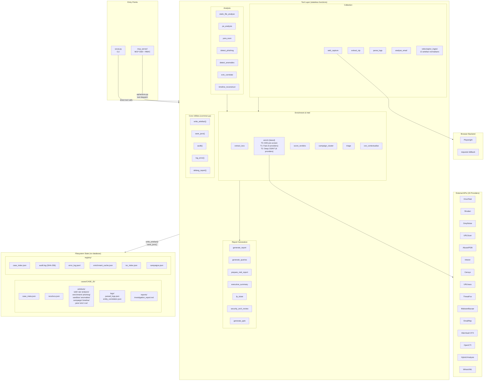
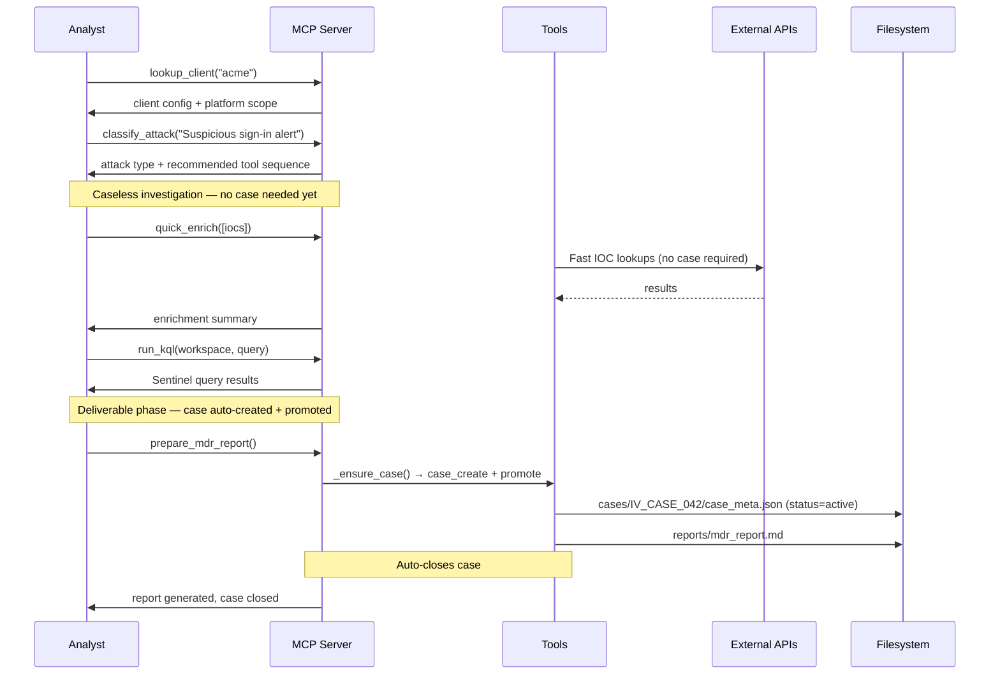

# SOC-AI Architecture Diagram

## High-Level System Architecture

```mermaid
graph TB
    subgraph Entry["Entry Points"]
        CLI["socai.py<br/>CLI"]
        MCP["mcp_server/<br/>MCP SSE + RBAC"]
    end

    CLI -->|"direct tool calls"| Tools
    MCP -->|"api/actions.py<br/>tool dispatch"| Tools

    subgraph Tools["Tool Layer (stateless functions)"]
        direction LR
        subgraph Collection["Collection"]
            WC["web_capture"]
            EZ["extract_zip"]
            PL["parse_logs"]
            AE["analyse_email"]
            VR["velociraptor_ingest<br/>13 artefact normalisers"]
        end
        subgraph Analysis["Analysis"]
            SFA["static_file_analyse"]
            PE["pe_analysis"]
            YARA["yara_scan"]
            DP["detect_phishing"]
            DA["detect_anomalies"]
            EVTX["evtx_correlate"]
            TL["timeline_reconstruct"]
        end
        subgraph Intel["Enrichment & Intel"]
            EI["extract_iocs"]
            EN["enrich (tiered)<br/>T0: ASN pre-screen<br/>T1: Fast (4 providers)<br/>T2: Deep OSINT (6 providers)"]
            SV["score_verdicts"]
            CC["campaign_cluster"]
            TR["triage"]
            CVE["cve_contextualise"]
        end
        subgraph Output["Report Generation"]
            GR["generate_report"]
            GQ["generate_queries"]
            MDR["prepare_mdr_report"]
            ES["executive_summary"]
            FP["fp_ticket"]
            SAR["security_arch_review"]
            PPTX["generate_pptx"]
        end
        subgraph Core["Core Utilities (common.py)"]
            WA["write_artefact()"]
            SJ["save_json()"]
            AU["audit()"]
            LE["log_error()"]
            DF["defang_report()"]
        end
    end

    Collection --> Intel
    Analysis --> Intel
    Intel --> Output

    subgraph ExtAPIs["External APIs (15 Providers)"]
        direction LR
        VT["VirusTotal"]
        SH["Shodan"]
        GN["GreyNoise"]
        US["URLScan"]
        AB["AbuseIPDB"]
        IZ["Intezer"]
        CS["Censys"]
        UH["URLhaus"]
        TF["ThreatFox"]
        MB["MalwareBazaar"]
        ER["EmailRep"]
        OTX["AlienVault OTX"]
        OCT["OpenCTI"]
        HA["Hybrid Analysis"]
        WX["WhoisXML"]
    end

    subgraph Browser["Browser Backend"]
        PW["Playwright"]
        RQ["requests fallback"]
    end

    %% All LLM reasoning is handled by the analyst's local Claude Desktop
    %% agent via MCP prompts — the server makes no Anthropic API calls.
    EN --> ExtAPIs
    WC --> Browser

    subgraph State["Filesystem State (no database)"]
        subgraph CaseDir["cases/CASE_ID/"]
            META["case_meta.json"]
            IOCS["iocs/iocs.json"]
            ART["artefacts/<br/>web/ zip/ analysis/<br/>enrichment/ phishing/<br/>sandbox/ anomalies/<br/>campaign/ timeline/<br/>yara/ evtx/ cve/"]
            LOGS["logs/<br/>parsed_logs.json<br/>entity_correlation.json"]
            RPT["reports/<br/>investigation_report.md"]
        end
        subgraph Registry["registry/"]
            CI["case_index.json"]
            ALOG["audit.log (SHA-256)"]
            ELOG["error_log.jsonl"]
            EC["enrichment_cache.json"]
            II["ioc_index.json"]
            CAMP["campaigns.json"]
        end
    end

    Tools -->|"write_artefact()<br/>save_json()"| State
```

## HITL Investigation Sequence

```mermaid
sequenceDiagram
    participant A as Analyst
    participant M as MCP Server
    participant T as Tools
    participant E as External APIs
    participant F as Filesystem

    A->>M: lookup_client("acme")
    M->>A: client config + platform scope

    A->>M: classify_attack("Suspicious sign-in alert")
    M->>A: attack type + recommended tool sequence

    Note over A,M: Caseless investigation — no case needed yet

    A->>M: quick_enrich([iocs])
    T->>E: Fast IOC lookups (no case required)
    E-->>T: results
    M->>A: enrichment summary

    A->>M: run_kql(workspace, query)
    M->>A: Sentinel query results

    Note over A,M: Deliverable phase — case auto-created + promoted

    A->>M: prepare_mdr_report()
    M->>T: _ensure_case() → case_create + promote
    T->>F: cases/IV_CASE_042/case_meta.json (status=active)
    T->>F: reports/mdr_report.md
    Note over M,T: Auto-closes case
    M->>A: report generated, case closed
```

